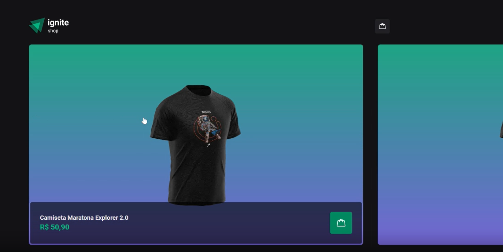
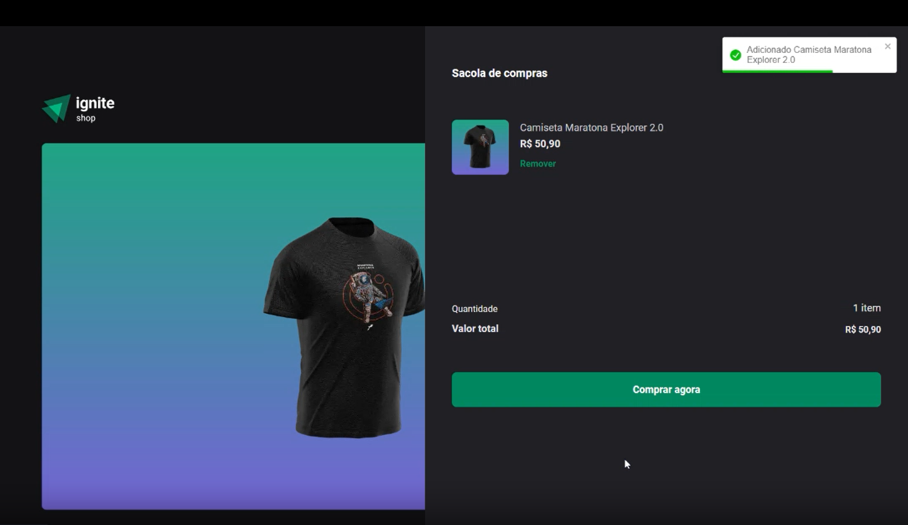
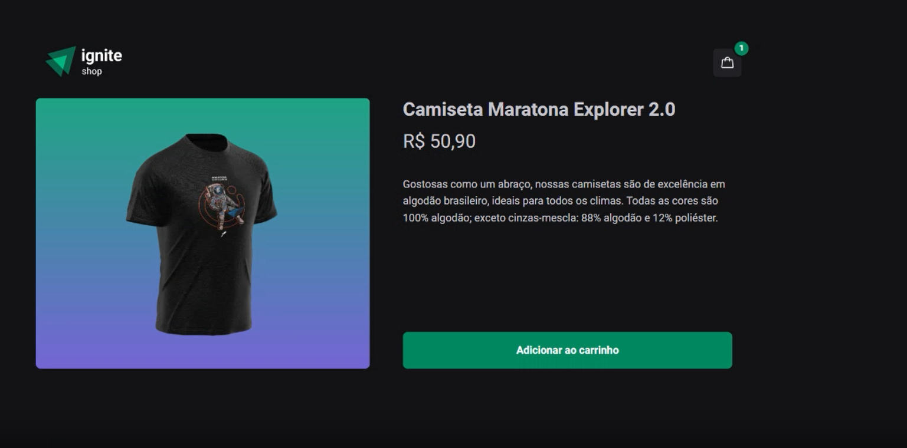
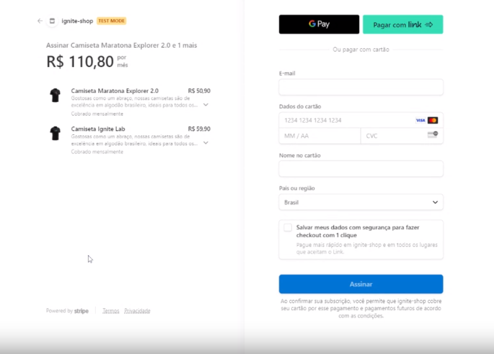
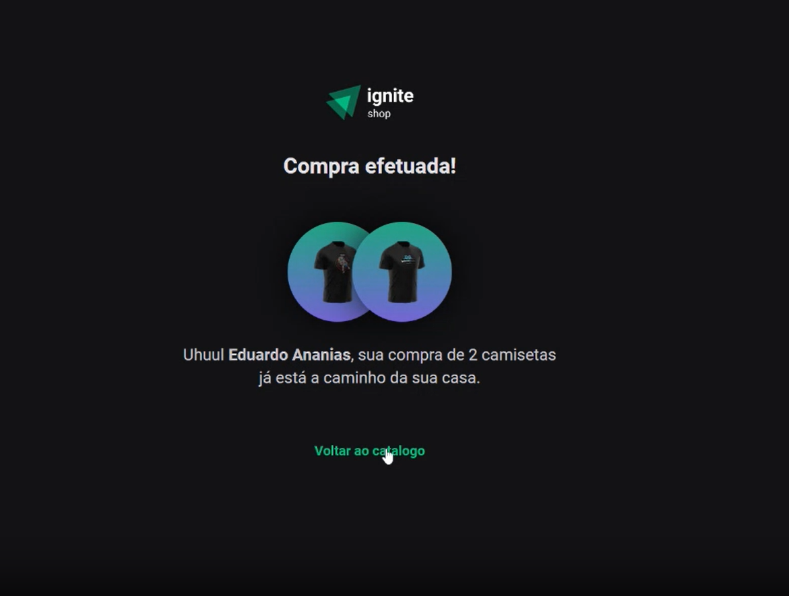

# Ignite Shop


> Projeto academico de um ecommerce com integração ao Stripe para realizar pagamentos, o projeto faz parte do desafio da trilha de React com Nextjs do Ignite [Rocketseat](http://app.ropcketseat.com.br)

<div
  style="width:100%; display:flex; gap:16px, flex-wrap: wrap"
>






</div>

## Detalhes do aplicativo

- Ignite shop é um projeto de ecommerce simples para venda de camisetas utilizando integração com a API de pagamentos da stripe, é possivel visualizar os produtos atraves de um carousel, adicionar ao carrinho de compras ou visualizar as informações detalhadas do produto. Para finalizar a compra será feito redirecionamento para pagina de checkout da stripe e após ser redirecionado para o site do Ignite shop com status de compra realizada.

## 🚀 Melhorias implementadas

- [x] - Estilização com stitches.
- [x] - Alerta de carrinho vazio.
- [x] - Biblioteca de icones phosphor icons.
- [x] - Utilizado biblioteca useShoppingCart para controle de contextos.
- [x] - Biblioteca Axios para chamadas Api.
- [x] - Biblioteca Toastfy para alertas.
- [x] - Biblioteca react-loading-skeleton para detalhes do produto.

## 💻 Como usar o projeto

Para rodar o projeto precisará realizar os procedimentos abaixo, por favor ler documentação do stripe para gerar suas chaves de acesso. `Lembre-se de que a chave de acesso é unica e intransferivel, não de há ninguem e nem deixe exposta em seu repositorio remoto`.

1 clone o projeto

```
git clone https://github.com/Du-devBR/rocketDesafioIgniteShop.git
```

2 Terminal

```
cd rocketDesafioIgniteShop
```

3 Instale as dependências necessárias com o comando

```
npm install
```

4 Rode o projeto

Desenvolvedor

```
npm run dev
```

Build

```
npm run build
```

```
npm run start
```

4 Crie uma conta Teste no stripe

```
https://dashboard.stripe.com/
```

5 Crie um arquivo .env.local na raiz do projeto e cole os comando abaixo

```
STRIPE_PUBLIC_KEY=cole aqui sua chave publica
STRIPE_SECRET_KEY=cole aqui sua chave privada
```

6 Adicione a varialvel de pagina

```
NETX_URL=http://localhost:3000
```

6 Adicione o .env.local ao .gitignore

```
.env*.local
```

## 🌐 Links úteis

[NextJs](https://nextjs.org/)
[Figma do projeto](<https://www.figma.com/file/3rptzmZeCcu2pD62n4VmJ0/Ignite-Shop-2.0-%E2%80%A2-Desafio-React-(Copy)?type=design&node-id=2%3A12&mode=design&t=imX2egC46ldmMsOJ-1>)

## Eduardo Ananias da Silva

[](https://www.linkedin.com/in/eduardo-ananias-29a53048/)
[](https://github.com/Du-devBR)
